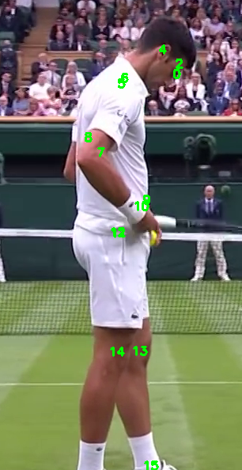

# Yolov8 ile Pose Estimation

Bu projemizde Yolov8 ile pose estimation(postür çıkarımı) yapacağız. Pose estimation vücudumuzdaki belirli noktaları tespit etmeye yarar. Biz bu noktaları kullanarak gerek spor gerek günlük hayatta bu bilgisayarlı görü modelini kullanarak kendi projelerimizi oluşturabiliyoruz. 

Örneğin şınav çeken sporcunun kaç şınav çektiğini, vucüt duruşunun uygunluğunu vb birçok durumu ele alabiliriz.



Resimde bir tenis sporcusunun vucüdundaki bazı önemli noktalar(eklem noktaları vs.) tespit edilmiştir. Bunlar kullanılarak çeşitli bilgisayarlı görü projeleri gerçekleştirilebilir. Unutmayın tek sınır sizin hayal gücünüzdür :)

Şimdi yazılımı çalıştırmak için repoyu klonlayalım:

```shell

git clone https://github.com/openytu/Yolov8-ile-Pose-Estimation

```


Ardından yazılımı çalıştıralım

```shell

python pose.py 

```

Bugünkü projemizin de sonuna geldik. Yeni bilgisayarlı görü projelerinde görüşmek üzere.

